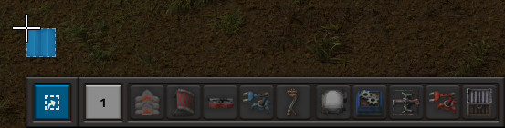
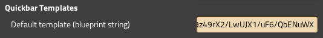

# Quickbar Templates

Quickly and easily import or export your quickbar configuration as blueprints.

## Installation

Download and install from the [mod portal.](https://mods.factorio.com/mod/QuickbarTemplates)

## Usage

Hold a blueprint, and a button will appear next to your quickbar. Clicking with
an empty blueprint will export your filters, and clicking with a non-empty
blueprint will import them.

Set a default template in mod settings menu by pasting a blueprint string.

